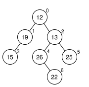
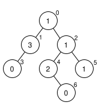

# Nádrže

Toto je popis řešení úlohy Nádrže na 70%.

## Algoritmus

Nádrže tvoří stromovou strukturu.
Tuto strukturu máme již zadanou.
Jediné co musíme udělat je pro každou nádrž uložit index na nadřazenou nádrž (rodiče).
To se dá snadno udělat při parsování vstupu - pro každou podnádrž uložit index nádrže jejíž podnádrží je.



### 1. Čerpání

Při čerpání nádrže se u ní pouze poznamená kolikrát z ní bylo čerpáno a to bude čteno při dotazu na plnost nádrže.

Např:
```
! 1
! 1
! 1
! 4
! 2
! 4
! 5
! 0
```

Po těchto čerpáních bude _meta strom_ vypadat takto:



To je pro čerpání všechno.

### 2. Dotaz na plnost nádrže

Při dotazu na plnost nádrže je třeba zjistit kolikrát z ní bylo čerpáno.
Z nádrže bylo vždy čerpáno tolikrát, kolikrát bylo čerpáno z ní nebo jakéhokoliv jejího přímého i nepřímého rodiče.
Počet čerpání nádrže tedy zjistíme tak, že z dotazované nádrže budeme traverzovat přes rodiče až ke kořenu stromu a sčítat čerpání všech nádrží po cestě. (nezapomenout započítat čerpání z dotazované nádrže)
Když máme kolikrát celkem bylo z nádrže čerpáno a její počáteční plnost, můžeme spočítat její aktuální plnost takovýmto pseudokódem:
```
result = inititalCapacity
repeat(pumpCount) {
    // Intiger division
    result = result - (result + 1) / 2
}
return result
```