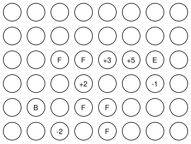
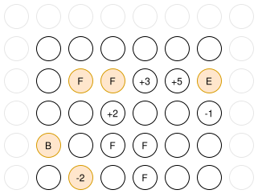
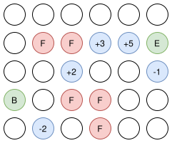
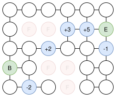
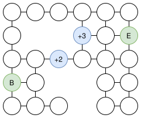
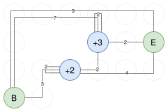

# Na úvod

Pro své řešení jsem měl následující předpoklady, které nejsou ze zadání jednoznačně jasné, ale podle sfingy se zdají být pravdivé:
- raketka se nemůže pohybovat diagonálně (tedy pouze rovnoběžně s jednou z os prostoru)
- raketka se může pohnout jakýmkoliv směren, nezávisle na tom odkud přilitěla (tj. může se vracet a opakovat stejné sektory)
- měla-li by raketka při vstupu do sektoru získat rychlost mimo konstrukční limity, tak zůstává původní rychlost (v případě přesažení rychlost tedy nezůstane na maximu, ale zůstane původní)
- z předchozích předpokladů tedy vychází též to, že raketka může lítat tam a zpět mezi sektory, (nebo i z a na jeden sektor) aby získala rychlost

Dále v dokumentu budu dávat příklady pouze z 2D prostoru, ale stejné principy fungují i ve 3D prostoru.

# Algoritmus

Skládá se z následujících kroků:
1. **Oříznutí prostoru** - zmenší prostor na vstupu tak, že se nepříjde o žádné řešení
2. **Stavba grafu** - vytvoření grafu s ohledem na zakázané sektory
3. **Zjednodušení grafu** - zjednodušení předchozího grafu na graf, kde jsou pouze speciální sektory a vzdálenosti mezi nimi
4. **Nalezení nejrychlejší cesty hloupě** - nejrychlejší cesta ze startu do cíle, kde se raketka nemůže vracet (upravený Dijkstra)
5. **Nalezení nejrychlejší cesty** - zkoušení všech možných cest pomocí DFS

## 1. Oříznutí prostoru

Každá strana 3D prostoru se ořízne (trim) o prostor prázdných sektorů, pokud tam nějaký je. Důlžité je, že pokud nejkrajnější sektor je zakázaný, tak se nesmí oříznout až k němu, aby se nbepřišlo o řešení, při kterém se dá latět okolo něj.

### Prostor před oříznutím
  
### Prostor po oříznutí (zvírazněny sektory, které stanovují hranici oříznutí)

## 2. Stavba grafu

Nový prostor z předchozího se vezme a postaví se graf. Zakázané sektory jsou ignorovány.

### Prostor před stavbou grafu

### Výsledný graf

## 3. Zjednodušení grafu

Nyní, vzhledem k tomu, že prázdné sektory nijak neovlivňují let raketky a jsou tedy v podstatě pouze vzdálenost, kterou raketka musí překonat, můžeme je z grafu ůplně odebrat a _převést_ na vzdálenost mezi speciálními sektory.
V tomto kroku se tedy najde **nejkratší cesta z každého sektoru do každého druhého sektoru, která vede pouze přes prázdné sektory** (pro zrychlovací/zpomalovací sektory též cesta do sektoru samotného, která je 2, pokude existuje - z něj a zpět do něj)

Na toto se používá upravený Dijkstrův algoritmus, který naviguje poze skrze prázdné sektory a narazí-li na speciální sektor, uloží vzdálenost k němu.

### Před zjednodušením grafu (pro jednoduchiost jiné zadání než doposud)

### Zjednodušený graf

## 4. Nalezení nejkratší cesty hloupě

Tento krok je důležitý pro následující krok.
Vzhledem k tomu, že v dalším kroku se zkouší všechny možné cesty a raketka může létat do nekonečna, (stále dokola) je potřeba stanovit nějaký terminační čas, kdy se oběvování dané trasy vzdá.
Tento krok je upravený Dijkstra algoritmus, rozdíl je v tom, že:
- u každo vrcholu se neukádá pouze nejkratší nalezená cesta, ale též rychlost, se kterou na ni raketka dorazila
- při objevování vrcholu se bere ohled na původní čas a rychlost, která je upravená, pokud se jde ze zrychlovacího/zpomalovacího sektoru

Tímto nalezneme nejrychlejší cestu, kdyby se raketka nemohla vracet.

## 5. Nalezení nejkratší cesty

V tomto kroce se zkouší všechny možné cesty.
Používá se rekurzivní DFS, který ale objevuje všechny sousedy daného vrcholu, tedy i ty, které už byly objeveny.
Tento rozdíl dělá to, že se raketka může i vracet, točit dokola a podobně, skutečně všechny možnosti.

_terminační čas_ je čas vypočtený v předchozím kroku.

Při objevování vrcholu jsou tyto kroky:
- vypočítá se čas a rychlost (podle předchozího vrcholu), se kterým jsme se na vrchol dostali
- je-li tento vrchol konečný a doposud nejlepší čas do cíle je horší než tento, uloží se tento nový čas do cíle
- zkontroluje se, zda čas na vrchol není větší než terminační čas, pokud ano, končí se s tímto vrcholem (backtrack)
- přečte se doposud nalezený čas a rychlost, se kterým jsme se na tento vrchol už někdy dostali, pokud takový je
- je-li stávající čas a rychlost 100% lepší než doposud nalezený, končí se s tímto vrcholem (backtrack)
  - s určením co je lepší je ten problém, že pomalejší čas může být někdy výhodnější, pokud je větší rychlost a obráceně. Proto kontrolujeme akorát připd, kdy to jistě lepší není a to je, když se čas nebo rychlost rovná a to druhý je lepší/horší, nebo pokud je obojí lepší
- naposledy opakujeme tento proces pro všechny sousedy

Jakmile se projdou všechny možnosti, je nalezena nejrychlejší cesta.